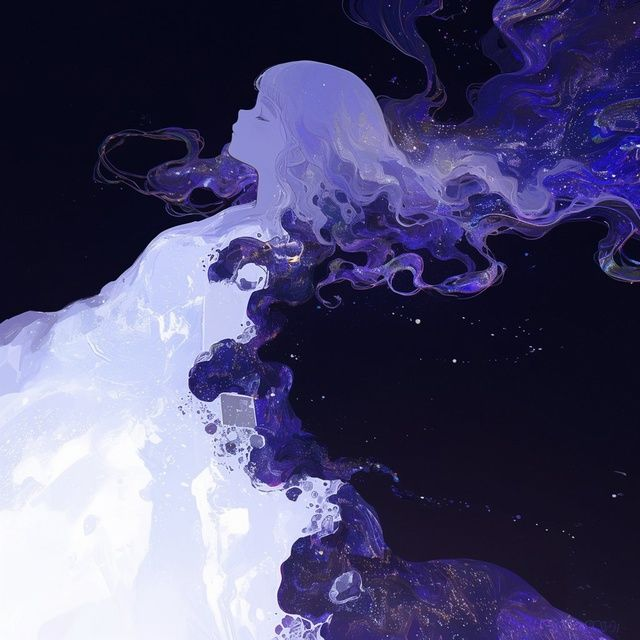
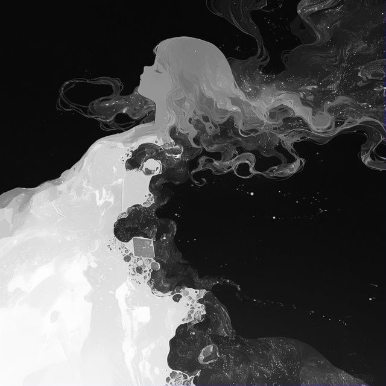
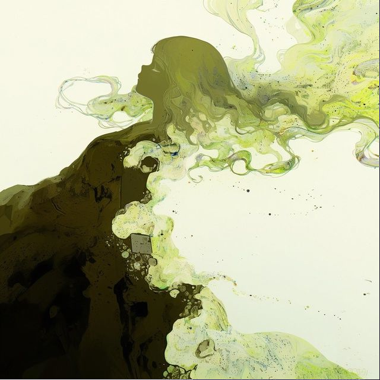
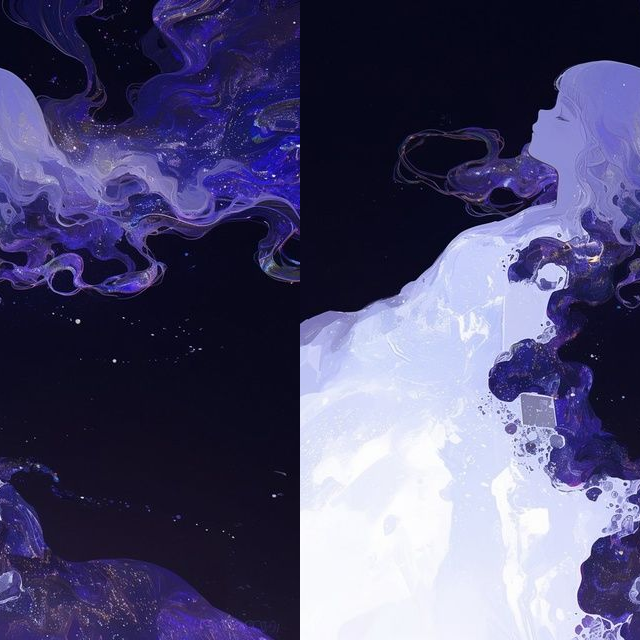

# BMP Editor Tool

**BMP Editor Tool** — это консольная утилита на языке C для редактирования и обработки 24-битных BMP-изображений. Проект ориентирован на высокую производительность за счет прямой манипуляции бинарными данными без использования сторонних графических библиотек.

## Основные возможности

Программа поддерживает набор фильтров и инструментов для трансформации холста:

* **Инверсия цветов**: Позволяет инвертировать цвета (RGB) в выбранной прямоугольной области.
* **Черно-белый фильтр**: Преобразование выбранной области изображения в оттенки серого.
* **Изменение размера (Canvas Resize)**: Добавление или обрезка пикселей с любой из четырех сторон (слева, справа, сверху, снизу) с возможностью выбора цвета заполнения.
* **Циклический сдвиг**: Сдвиг изображения по осям X, Y или обеим осям одновременно.
* **Просмотр метаданных**: Вывод подробной технической информации о заголовках `BitmapFileHeader` и `BitmapInfoHeader`.

### Результат работы фильтра Gray:
| Исходное (BMP)     | После обработки                 |
|:-------------------|:--------------------------------|
| `original.bmp`     |  |
| `Grayscale`        |      |
| `Inverse`          |  |
| `Cyclic Shift`     |     |

## Сборка проекта

Проект использует кроссплатформенный `Makefile`, который автоматически определяет операционную систему (Windows или Linux) и настраивает команды сборки и очистки.

### Требования

* Компилятор `GCC` (поддержка стандарта C11).
* Утилита `make` (или `mingw32-make` для Windows).

### Компиляция

В папке проекта выполните:

```bash
make

```

После этого будет создан исполняемый файл `bmp-editor` (или `bmp-editor.exe` на Windows).

## Использование

Общий синтаксис запуска:

```bash
./bmp-editor [OPTIONS] input_file.bmp

```

### Основные флаги

* `-h, --help`: Показать справку.
* `-i, --info`: Показать информацию о заголовках файла.
* `-o, --output FILE`: Указать имя выходного файла (по умолчанию — `out.bmp`).

### Примеры команд

**1. Добавление красной рамки (100 пикселей слева):**

```bash
./bmp-editor --resize --left 100 --color 255.0.0 input.bmp

```

**2. Инверсия цветов в центральной части изображения:**

```bash
./bmp-editor --inverse --left_up 100.100 --right_down 400.400 input.bmp -o inverted.bmp

```

**3. Циклический сдвиг по оси X на 50 пикселей:**

```bash
./bmp-editor --shift --axis x --step 50 input.bmp

```

## Технические ограничения

Для обеспечения корректной работы утилиты входные файлы должны соответствовать следующим критериям:

* **Формат**: Только стандартные файлы с заголовком `BITMAPINFOHEADER` (v3, 40 байт).
* **Цвет**: Глубина цвета — ровно 24 бита на пиксель (без альфа-канала).
* **Сжатие**: Поддерживаются только несжатые изображения.

## Структура проекта

Проект разделен на логические модули для удобства поддержки и расширения:

* `main.c`: Точка входа и управление логикой приложения.
* `bmp.h`: Определения структур данных и прототипы функций.
* `bmp_io.c`: Функции чтения/записи файлов и работы с памятью.
* `bmp_filters.c`: Алгоритмы обработки изображений и трансформации.
* `cli.c`: Парсинг аргументов командной строки и пользовательский интерфейс.

---
